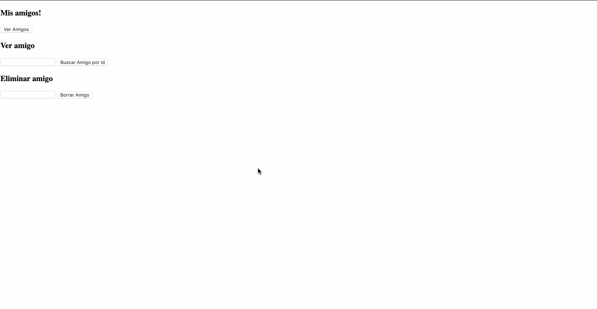

# Utilizacion de AJAX

#### Pre-requisitos:
> Para poder correr el servidor necesitaras tener NodeJs instalado. Puedes descargarlo e instalarlo entrando a la [pagina oficial](https://nodejs.org/en/download/)

Una vez que hayas instalado NodeJs, ve al directorio `Frieds` desde la terminal y corre estos dos comandos:
```shell
npm install
npm start # Este ultimo comando no nos retornara la terminal, sino que quedara ejecutando. Necesitamos dejarlo abierto mientras trabajamos
```

#### Informacion:
- Se utiliza un localhost para poder acceder a la base de datos de amigos

- Todavia no esta terminado el poder agregar amigos

#### Inspiracion:
Se hizo como tarea para poder completar las funciones y que quede como el siguiente gif. Despues se le dio estilos.



